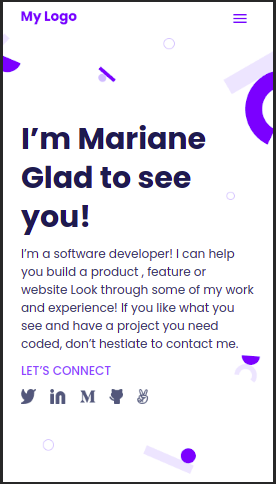

# Portfolio

> Portfolio of Microverse projects



This project is a portfolio of projects I build at Microverse.

Things done so far in the project:

#### 1. Build mobile skeleton

* Parse a Figma design
* Use Flexbox for positioning
* Use images and backgrounds

## Built With

- Major languages: HTML, CSS
- Frameworks: none
- Technologies used: Lighthouse, Webhint, Stylelint

## Live Demo

[Live Demo Link](https://akasharojee.github.io/portfolio/)

## Getting Started

To get a local copy up and running follow these simple example steps.

Use the following command in your terminal:

* **To clone the main project**
```
git clone https://github.com/AkashaRojee/portfolio
```

* **To clone the mobile-skeleton branch**

```
git clone -b mobile-skeleton https://github.com/AkashaRojee/portfolio
```

**Notes:**

* So far, only the first 2 sections of the mobile skeleton have been built. Please, view the website in mobile version.

* Nothing has been merged to main yet.

## Authors

👤 **Akasha Rojee**

- GitHub: [@AkashaRojee](https://github.com/AkashaRojee)
- Twitter: [@AkashaRojee](https://twitter.com/AkashaRojee)
- LinkedIn: [Akasha Rojee](https://linkedin.com/in/AkashaRojee)

## 🤝 Contributing

Contributions, issues, and feature requests are welcome!

Feel free to check the [issues page](https://github.com/AkashaRojee/portfolio/issues).

## Show your support

Give a ⭐️ if you like this project!

## 📝 License

This project is [MIT](./MIT.md) licensed.